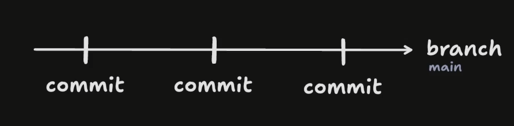
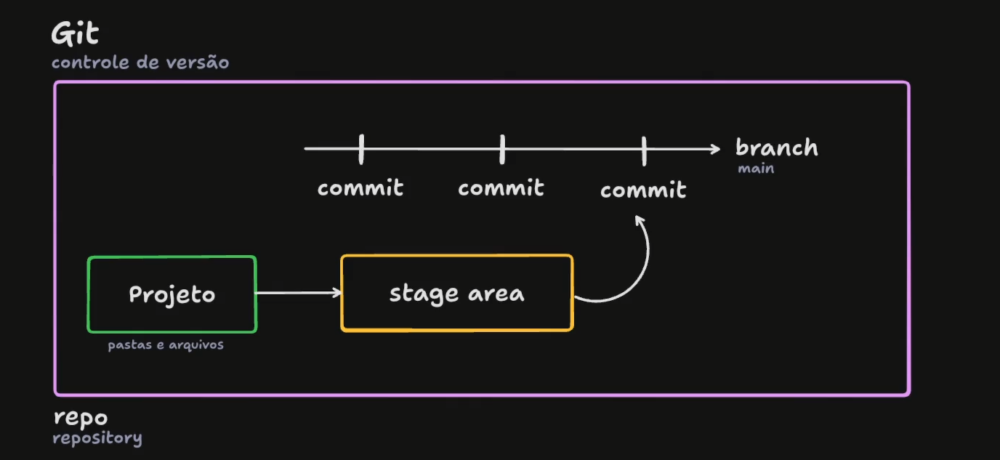
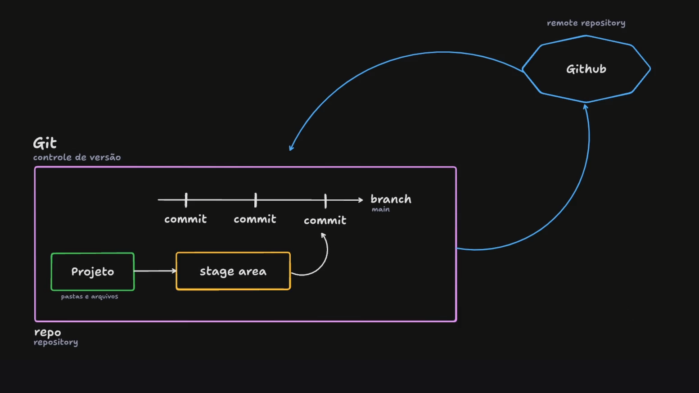

# Stage 02 - Git e GitHub

## Git

Faz o controle de versões do meu projeto. 

Por exemplo:

> Fiz um projeto com um button inicialmente na cor amarela e, alterei ele para cor Verde.

Eu alterei a versão do meu projeto com a mudança de cor do button. O Git faz justamente esse controle das versões de alteração.

---
Explicando com uma imagem:

- **Commit:** é o ato de salvar uma alteração ou um conjunto de alterações feitas no projeto;

- **Branch:** em português "Ramificação", é a linha de desenvolvimento separada em um projeto, onde a *main* é a linha principal.

Posso ter mais **Branches** no meu projeto para a execução de testes e novas funcionalidades, sem alterar a *Branch Main*. E, se futuramente estiver tudo validado, funcionando e autorizado, posso também puxar essa branch alternativa para a principal, a *main*.

---
Ainda sobre o Git:

- **Projeto:** são as pastas e arquivos do projeto, gerenciados pelo Git através de alterações/exclusões, adições e exclusões;
- **Stage Area:** onde a modificação que foi feita em certo arquivo/pasta fica. O arquivo fica em *Preparação* antes de ser "commitado".
- **Repository/Repo:** é onde o projeto fica localmente, juntamente com o Git para fazer o controle de versão dele.

---

## GitHub

É o **repositório remoto** (nuvem) que posso adicionar o meu projeto que estava salvo localmente.

